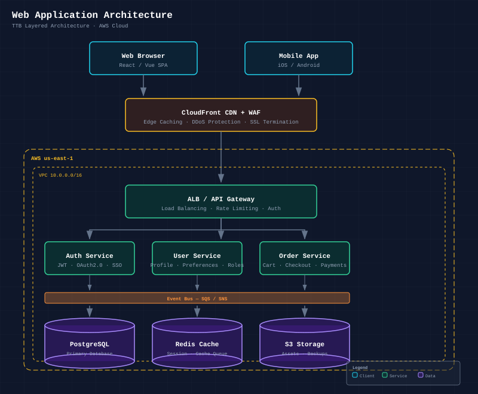
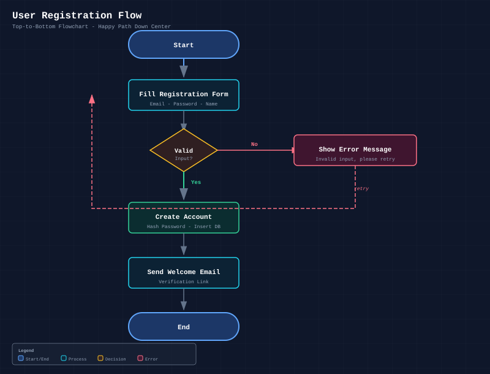
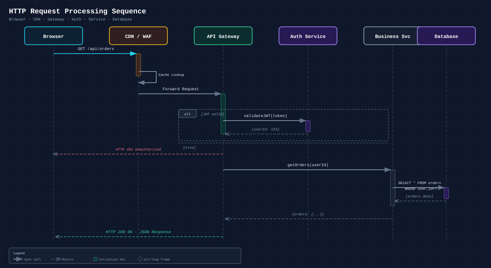
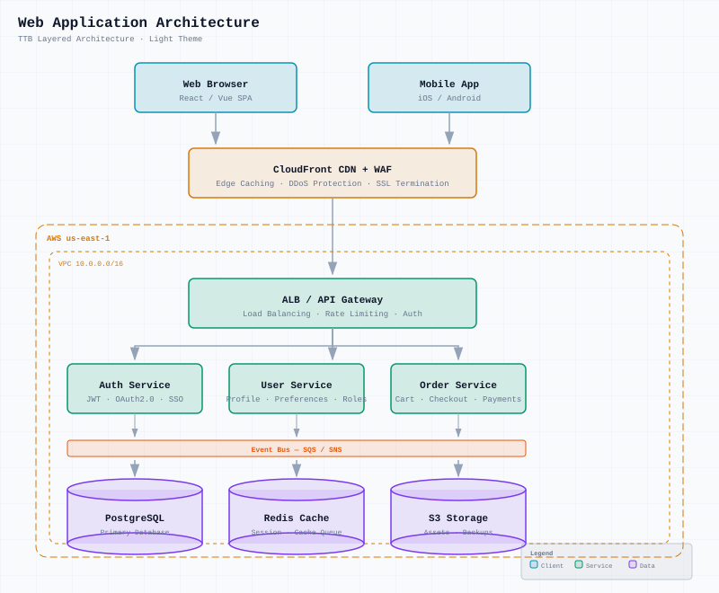

# SVG Diagram Drawer Skill

[](https://skills.sh)

> **Generate professional SVG diagrams** — architecture, flowcharts, sequence diagrams, structural diagrams, and more. Dark and light themes. Self-contained `.svg` output with embedded styles. Optional PNG export via `@resvg/resvg-js`.

## ✨ Features

- 🎯 **9 diagram types** — Architecture, Flowchart, Sequence, Structural, Mind Map, Timeline, Illustrative, State Machine, Data Flow
- 🌓 **Dark & Light themes** — Two complete color palettes with overrides for background, text, strokes, and masks
- 🖼️ **PNG export** — Convert SVG to crisp @2x/@3x PNG via `@resvg/resvg-js` with proper system font rendering
- 📦 **Self-contained** — Single `.svg` file output, no runtime dependencies, all styles and fonts embedded
- 🔤 **System fonts** — Uses macOS system fonts (Menlo, Monaco, Courier New) — renders correctly in both browser and PNG export
- 🧊 **No overlap** — Opaque masking rect trick hides arrows behind semi-transparent components

## 📦 Installation

### Via `gh skill`

```bash
gh skill install AkatQuas/svg-diagram-drawer-skill
```

### Via `npx skills`

```bash
npx skills add AkatQuas/svg-diagram-drawer-skill
```

### Manual clone

```bash
git clone https://github.com/AkatQuas/svg-diagram-drawer-skill.git
cd svg-diagram-drawer-skill
cd scripts && bun install && cd ..
```

## 🖼️ Examples

| Architecture (Dark) | Flowchart (Dark) |
|:---:|:---:|
| [](./examples/architecture-web-app.svg) | [](./examples/flowchart-user-registration.svg) |

| Sequence (Dark) | Architecture (Light) |
|:---:|:---:|
| [](./examples/sequence-http-request.svg) | [](./examples/architecture-web-app-light.svg) |

---

## 🚀 Quick Start

### Generate an SVG diagram

```bash
# Create a diagram SVG following the design system in SKILL.md
# Then convert to PNG:
bun scripts/main.ts my-diagram.svg
# → my-diagram@2x.png
```

### Convert to PNG with options

```bash
bun scripts/main.ts <input.svg> [options]
```

Options:
- `-s, --scale <n>` — Scale factor (default: 2, recommended: 3 for sharper output)
- `-o, --output <path>` — Custom output path
- `--json` — JSON output

### Examples

```bash
# Default 2x PNG
bun scripts/main.ts examples/architecture-web-app.svg

# 3x for sharper output
bun scripts/main.ts examples/flowchart-user-registration.svg -s 3

# Custom output path
bun scripts/main.ts examples/sequence-http-request.svg -o output.png -s 3
```

## 📌 Compatible Platforms

- Cline
- Cursor Agent
- Claude Code
- Windsurf
- OpenClaw
- Any platform supporting the Agent Skills specification

## 📄 License

[MIT](./LICENSE)

## 📖 References

- [@resvg/resvg-js](https://github.com/yisibl/resvg-js) — SVG to PNG renderer with system font support
- [Inspired by baoyu-skills](https://github.com/JimLiu/baoyu-skills/tree/main/skills/baoyu-diagram) — Original diagram skill by JimLiu